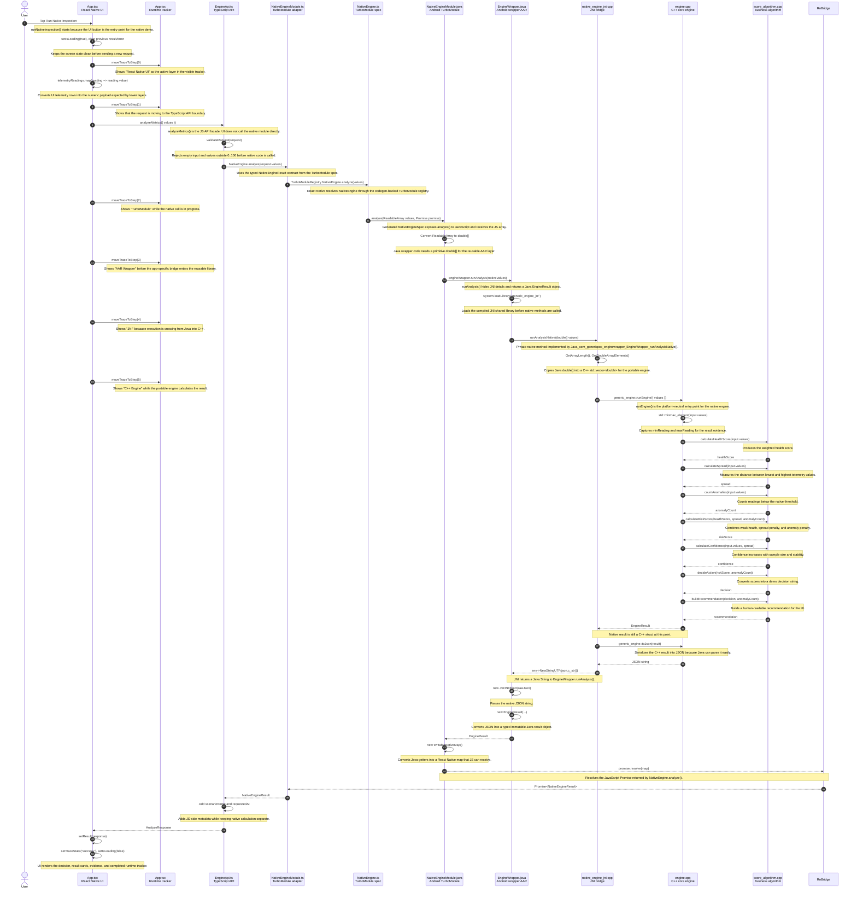
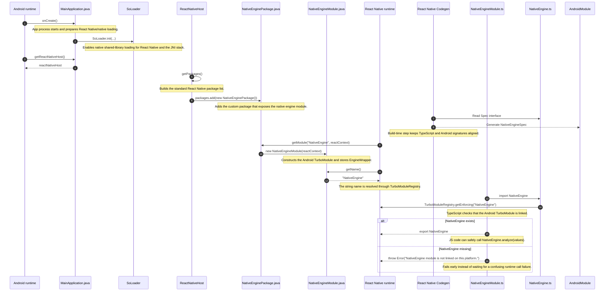
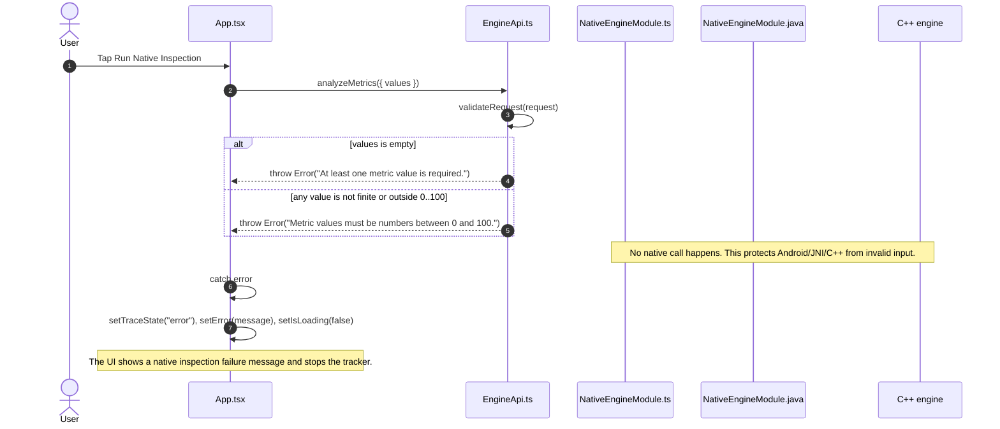
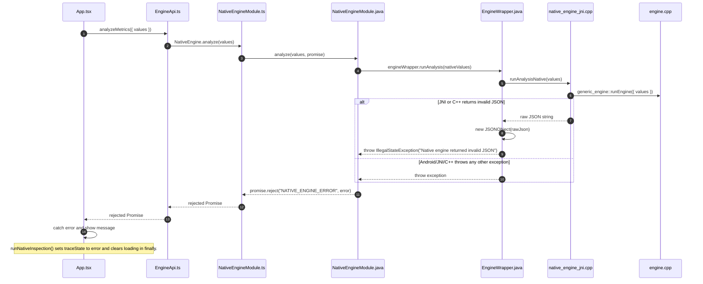

# Mermaid Sequence Diagrams

This document explains the exact runtime call sequence in the native engine POC
using Mermaid diagrams. The diagrams include the function names, the layer that
owns each function, and why the call is needed.

## Main Success Flow

This is the primary demo flow after the user taps **Run Native Inspection**.



## Startup And Native Module Registration

This flow happens before the user taps the button. It explains how
the `NativeEngine` TurboModule becomes available to TypeScript.



## TypeScript Validation Failure Flow

This shows what happens when the UI sends invalid values. The request stops in
TypeScript and never reaches Android, JNI, or C++.



## Native Error Flow

This is the failure path after TypeScript validation passes but a lower layer
throws an exception.



## Function-To-Layer Reference

| Layer | File | Main function or method | Why it exists |
|-------|------|-------------------------|---------------|
| React Native UI | `apps/mobile/src/App.tsx` | `runNativeInspection()` | Starts the demo, prepares telemetry, controls loading/error/result state, and updates the visible tracker. |
| React Native UI | `apps/mobile/src/App.tsx` | `moveTraceToStep(index)` | Makes the runtime path visible one layer at a time during the demo. |
| TypeScript API | `apps/mobile/src/api/EngineApi.ts` | `analyzeMetrics(request)` | Stable API boundary used by UI; validates input and adds JS-side response metadata. |
| TypeScript API | `apps/mobile/src/api/EngineApi.ts` | `validateRequest(request)` | Stops invalid values before Android/JNI/C++ are called. |
| TurboModule spec | `apps/mobile/src/specs/NativeEngine.ts` | `TurboModuleRegistry.getEnforcing("NativeEngine")` | Codegen-backed contract between JavaScript and Android. |
| TypeScript native adapter | `apps/mobile/src/native/NativeEngineModule.ts` | `NativeEngine.analyze(values)` | Stable adapter used by the app API layer. |
| Android bridge registration | `apps/mobile/android/app/src/main/java/com/genericpoc/mobile/MainApplication.java` | `getPackages()` | Registers `NativeEnginePackage` with React Native. |
| Android TurboModule registration | `apps/mobile/android/app/src/main/java/com/genericpoc/mobile/NativeEnginePackage.java` | `getModule(...)` | Lazily creates and exposes `NativeEngineModule`. |
| Android native module | `apps/mobile/android/app/src/main/java/com/genericpoc/mobile/NativeEngineModule.java` | `getName()` | Registers the JS-visible module name as `NativeEngine`. |
| Android native module | `apps/mobile/android/app/src/main/java/com/genericpoc/mobile/NativeEngineModule.java` | `analyze(ReadableArray, Promise)` | Receives JS calls, converts JS input to Java primitives, calls the AAR, and resolves/rejects the JS Promise. |
| Android wrapper AAR | `native/android-wrapper/src/main/java/com/genericpoc/enginewrapper/EngineWrapper.java` | `runAnalysis(double[])` | Reusable Java facade around JNI; parses JSON into `EngineResult`. |
| Android wrapper AAR | `native/android-wrapper/src/main/java/com/genericpoc/enginewrapper/EngineWrapper.java` | `runAnalysisNative(double[])` | Native method implemented in C++ through JNI. |
| JNI bridge | `native/android-wrapper/src/main/cpp/native_engine_jni.cpp` | `Java_com_genericpoc_enginewrapper_EngineWrapper_runAnalysisNative(...)` | Converts Java arrays to C++ vectors, calls the core engine, and returns a Java string. |
| C++ core engine | `native/core-engine/src/engine.cpp` | `generic_engine::runEngine(input)` | Platform-neutral orchestration for native calculation. |
| C++ core engine | `native/core-engine/src/engine.cpp` | `generic_engine::toJson(result)` | Serializes the C++ result for Java. |
| Business algorithm | `native/core-engine/src/algorithm/score_algorithm.cpp` | `calculateHealthScore(values)` | Computes the weighted health score used by `runEngine()`. |
| Business algorithm | `native/core-engine/src/algorithm/score_algorithm.cpp` | `calculateSpread(values)` | Computes input spread from min/max. |
| Business algorithm | `native/core-engine/src/algorithm/score_algorithm.cpp` | `countAnomalies(values)` | Counts weak readings. |
| Business algorithm | `native/core-engine/src/algorithm/score_algorithm.cpp` | `calculateRiskScore(healthScore, spread, anomalyCount)` | Produces the risk score from health, spread, and anomalies. |
| Business algorithm | `native/core-engine/src/algorithm/score_algorithm.cpp` | `calculateConfidence(values, spread)` | Estimates result confidence. |
| Business algorithm | `native/core-engine/src/algorithm/score_algorithm.cpp` | `decideAction(riskScore, anomalyCount)` | Converts score output into a demo decision. |
| Business algorithm | `native/core-engine/src/algorithm/score_algorithm.cpp` | `buildRecommendation(decision, anomalyCount)` | Builds user-facing recommendation text. |
| Business algorithm utility | `native/core-engine/src/algorithm/score_algorithm.cpp` | `calculateAverage(values)` | Utility function available in the algorithm module; it is not called by the current `runEngine()` path. |

## How To Use This In A Demo

1. Open this file in a Mermaid-compatible viewer.
2. Show the **Startup And Native Module Registration** diagram first to explain
   how the native module becomes callable from JavaScript.
3. Show the **Main Success Flow** diagram while running the app.
4. Filter Logcat with:

```bash
adb logcat | grep -E "RN App|EngineApi|NativeEngineModule|EngineWrapper|NativeEngineJNI|CoreEngine|ScoreAlgorithm"
```

5. Match the log tags to the participants in the diagram.
